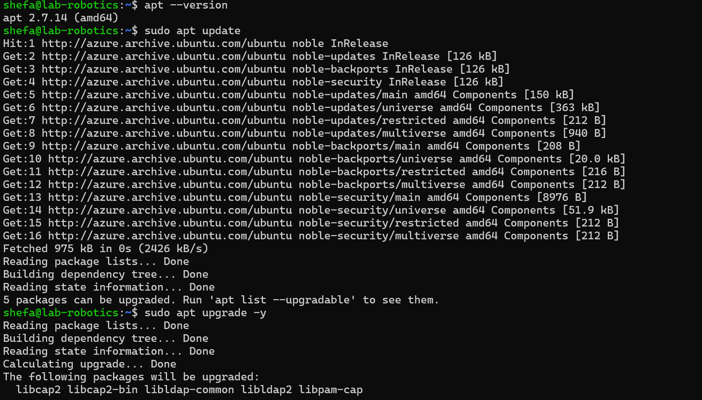
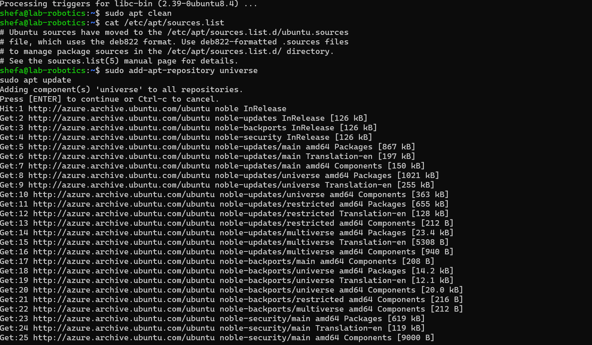
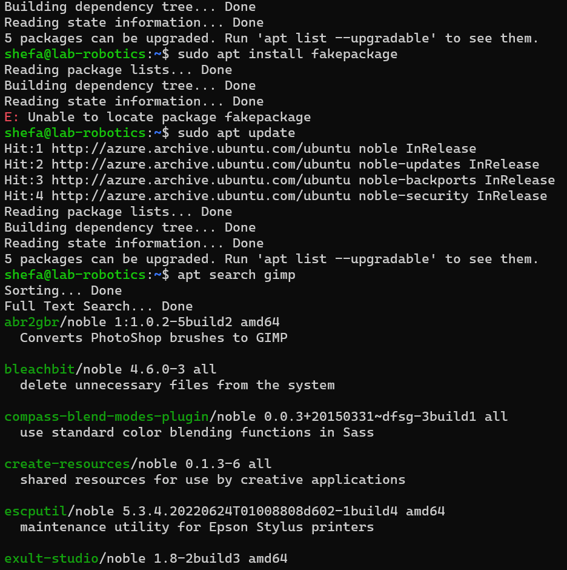

Part 1:

1.Apt version:
- apt 2.7.14 (amd64)

2.why this step is important?
- This step refreshes the list of available packages and their versions. It ensures that your system knows about the latest updates and can install them when requested.

3.What is the difference between update and upgrade?
- Sudo apt update only updates the local database of available packages. It doesn’t install anything.
-Sudo apt upgrade installs newer versions of the packages already installed on your system. The -y flag automatically answers "yes" to prompts.

4.Pending updates:
-libldap-common/noble-updates 2.6.7+dfsg-1~exp1ubuntu8.2 all [upgradable from: 2.6.7+dfsg-1~exp1ubuntu8.1]
libldap2/noble-updates 2.6.7+dfsg-1~exp1ubuntu8.2 amd64 [upgradable from: 2.6.7+dfsg-1~exp1ubuntu8.1]

Part 2:

5. Name:
-gimp/noble-updates 2.10.36-3ubuntu0.24.04.1 amd64
  GNU Image Manipulation Program.

  6.Require Depends:
  - libgimp2.0t64 (>= 2.10.36), libgimp2.0t64 (<= 2.10.36-z), gimp-data (>= 2.10.36), gimp-data (<= 2.10.36-z), graphviz, xdg-utils, libaa1 (>= 1.4p5), libbabl-0.1-0 (>= 1:0.1.78), libbz2-1.0, libc6 (>= 2.38), libcairo2 (>= 1.12.2), libfontconfig1 (>= 2.12.6), libfreetype6 (>= 2.2.1), libgcc-s1 (>= 3.3.1), libgdk-pixbuf-2.0-0 (>= 2.30.8), libgegl-0.4-0t64 (>= 1:0.4.38), libgexiv2-2 (>= 0.10.6), libglib2.0-0t64 (>= 2.79.0), libgs10 (>= 9.10~dfsg), libgtk2.0-0t64 (>= 2.24.10), libgudev-1.0-0 (>= 167), libharfbuzz0b (>= 0.6.0), libheif1 (>= 1.13.0), libjpeg8 (>= 8c), libjson-glib-1.0-0 (>= 1.5.2), libjxl0.7 (>= 0.7.0), liblcms2-2 (>= 2.9), liblzma5 (>= 5.1.1alpha+20120614), libmng2 (>= 2.0.2), libmypaint-1.5-1 (>= 1.5.0), libopenexr-3-1-30 (>= 3.1.5), libopenjp2-7 (>= 2.0.0), libpango-1.0-0 (>= 1.29.4), libpangocairo-1.0-0 (>= 1.29.4), libpangoft2-1.0-0 (>= 1.29.4), libpng16-16t64 (>= 1.6.2), libpoppler-glib8t64 (>= 0.44.0), librsvg2-2 (>= 2.32.0), libstdc++6 (>= 13.1), libtiff6 (>= 4.0.3), libwebp7 (>= 1.3.2), libwebpdemux2 (>= 1.3.2), libwebpmux3 (>= 1.3.2), libwmf-0.2-7 (>= 0.2.12), libwmflite-0.2-7 (>= 0.2.12), libx11-6, libxcursor1 (>> 1.1.2), libxext6, libxfixes3, libxmu6 (>= 2:1.1.3), libxpm4, zlib1g (>= 1:1.1.4)

8.Installed version:
- gimp-data/noble-updates,now 2.10.36-3ubuntu0.24.04.1 all [installed,automatic]
gimp/noble-updates,now 2.10.36-3ubuntu0.24.04.1 amd64 [installed]
libgimp2.0t64/noble-updates,now 2.10.36-3ubuntu0.24.04.1 amd64 [installed,automatic]

Part 3:
9. Is the package fully removed?
-The package is not fully removed because its configuration files are still present. The next step will fully remove the package.

10.Difference between Remove and Purge:
-Remove deletes the package but leaves configuration files intact.
Purge deletes both the package and its configuration files, ensuring a complete removal.

11.Why is this step important?
-The autoremove command removes any packages that were automatically installed as dependencies and are no longer needed. This helps free up disk space and keeps your system clean.       

12. What does this command do?
-The clean command removes all downloaded package files (stored in /var/cache/apt/archives). These files are no longer needed after installation and can take up significant space if not cleaned regularly.                                 

Part 4:
13. What do you notice in this file?
-This file see lines starting with deb or deb-src, indicating binary packages and source packages respectively Repositories might include official Ubuntu/Debian repositories, security updates, and third-party PPAs.  

14. What types of packages are found in the universe repository?
-The universe repository contains community-maintained software packages that are not officially supported by the distribution maintainers.

15.Error Massage:
-E: Unable to locate package fakepackage.
To troubleshoot this issue I will Check for typos in the package name, run sudo apt update to refresh package lists, search for the correct package name using apt search.

